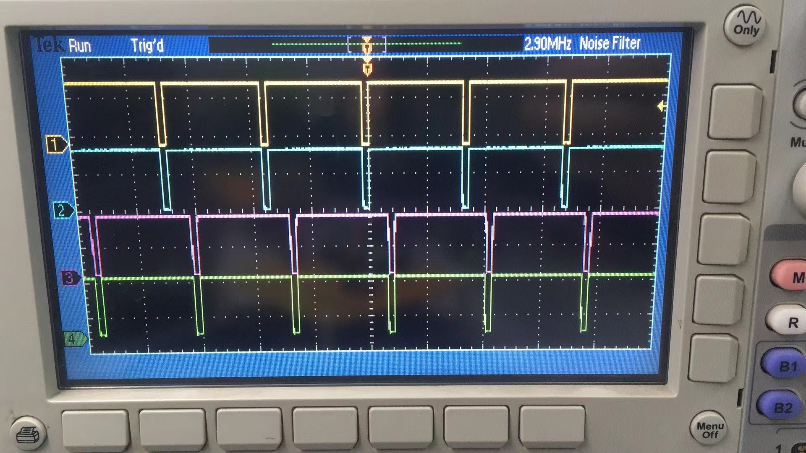
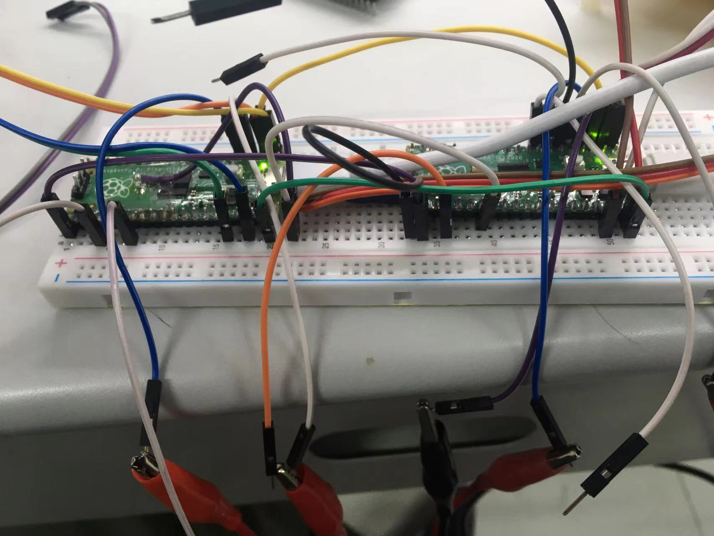

Pico-PIO-PWM

A PWM implementation with deadband and phase control for rp2040 base on the PIO.

Currently just implement phase control.

This library can run on multiple picos, synchronize their pwm clock, and arbitrary
phase control.

The figure below shows that two pico's pwms, synchronize and phase shift.

The connection.

The second pico's crystal oscillator removed, and connect the XIN to another pico PIN21. And the first pico `PWM_SYNC_OUT_PIN(PIN17)` connect to two picos `PWM_SYNC_IN_PIN(PIN16)`, which will sync start two pico pwms.
